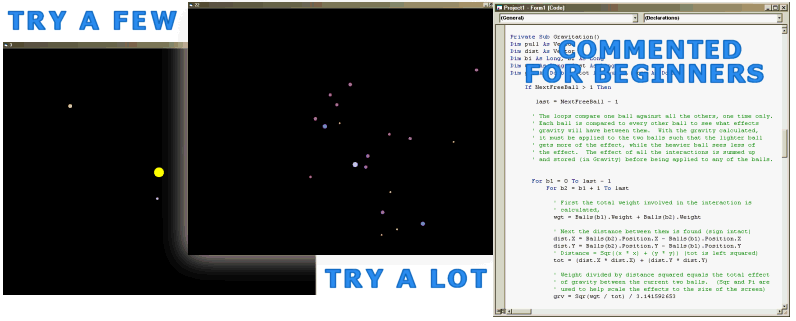



## \[A Gravity SImulator\]

### Description

This program allows the user to set balls in motion where the balls are attracted to eachother based on the physics of gravity. Size, direction, and speed are adjustable when the balls are created. Included comments turn it into a bit of a tutorial on how to achieve this effect.
 
### More Info
 

             |
---                |---
**Submitted On**   |2005-05-14 05:38:14
**By**             |[Larry Serflaten](https://github.com/Planet-Source-Code/PSCIndex/blob/master/ByAuthor/larry-serflaten.md)
**Level**          |Beginner
**User Rating**    |4.9 (83 globes from 17 users)
**Compatibility**  |VB 5\.0, VB 6\.0
**Category**       |[Graphics](https://github.com/Planet-Source-Code/PSCIndex/blob/master/ByCategory/graphics__1-46.md)
**World**          |[Visual Basic](https://github.com/Planet-Source-Code/PSCIndex/blob/master/ByWorld/visual-basic.md)
**Archive File**   |[\[A\_Gravity1888225142005\.ZIP](https://github.com/Planet-Source-Code/larry-serflaten-a-gravity-simulator__1-60525/archive/master.zip)

